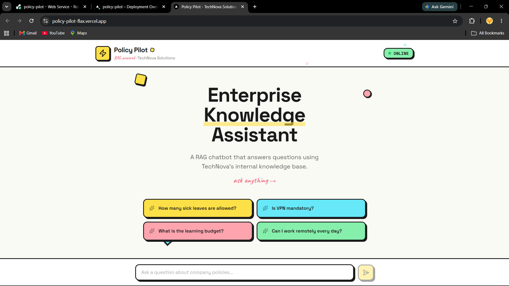
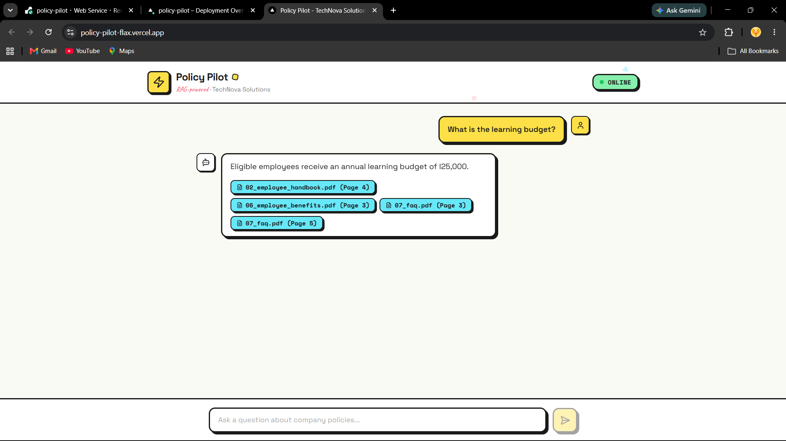

# Policy Pilot (Enterprise Knowledge Assistant)

   

Policy Pilot is an enterprise-grade Retrieval-Augmented Generation (RAG) chatbot designed to answer employee questions by securely querying internal company documents. By restricting the Large Language Model's knowledge domain strictly to the provided context, the assistant ensures high accuracy and minimizes hallucinations.

## Architecture Overview

The application follows a decoupled client-server architecture:
- **Frontend**: A minimal, responsive chat interface built with Next.js and Tailwind CSS.
- **Backend**: A high-performance REST API built with FastAPI.
- **Database & AI**: Document embeddings are generated via Gemini's Embedding API and stored in a persistent ChromaDB vector database. User queries are grounded in this retrieved context and synthesized using Gemini 2.5 Flash.

## Features

- **Document Ingestion Pipeline**: Converts PDF policies into semantic chunks, generates vector embeddings, and stores them in ChromaDB.
- **Context-Aware Retrieval**: Accurately retrieves Top-K chunks based on semantic similarity to the user's question.
- **Hallucination Prevention**: Strictly prompt-engineered to refuse answering questions not covered in the knowledge base.
- **Source Attribution**: Transparently displays which documents and pages were used to construct the answer.
- **Resilient Startup**: Automatically initializes the vector database and triggers ingestion if run on a fresh deployment environment (e.g., Render).

## Tech Stack

| Category | Technology |
|---|---|
| **Frontend** | Next.js, TypeScript, Tailwind CSS |
| **Backend** | FastAPI, Python, Pydantic |
| **AI Models** | Gemini 2.5 Flash, Gemini Embedding API |
| **Vector Database** | ChromaDB |
| **Document Processing** | PyMuPDF (fitz) |
| **Deployment** | Vercel (Frontend), Render (Backend) |

## Folder Structure

```text
policy-pilot/
├── backend/            # FastAPI application and Python scripts
│   ├── app/            # Core backend logic (API, models, services)
│   ├── knowledge_base/ # Source PDF documents
│   └── scripts/        # Utility scripts (e.g., manual ingestion)
├── frontend/           # Next.js application
│   ├── app/            # Next.js App Router
│   └── components/     # React components for the chat interface
└── reports/            # Project reports and documentation
```

## RAG Workflow

1. **Ingestion**: PDFs are loaded, cleaned, and chunked with slight overlaps. Each chunk is embedded and stored in ChromaDB.
2. **Querying**: User asks a question in the frontend. The backend embeds the query.
3. **Retrieval**: The backend searches ChromaDB for the semantically closest document chunks.
4. **Generation**: The chunks are injected into a strict prompt template alongside the query. Gemini generates an answer strictly using the provided context.

## Screenshots

<h3>Landing Page</h3>

<p align="center">
  
</p>

<h3>Answer with Source Badges</h3>

<p align="center">
  
</p>


## API Endpoints

- `GET /health` - Returns the connectivity status of the vector database and Gemini API.
- `POST /chat` - Accepts a user question and returns a grounded answer with source metadata.

## Local Installation

### Backend Setup
1. Navigate to the backend directory:
   ```bash
   cd backend
   ```
2. Create and activate a virtual environment:
   ```bash
   python -m venv venv
   source venv/bin/activate  # On Windows: .\venv\Scripts\activate
   ```
3. Install dependencies:
   ```bash
   pip install -r requirements.txt
   ```
4. Set up environment variables by copying `.env.example` to `.env` and adding your `GEMINI_API_KEY`.
5. Run the server (ingestion runs automatically if the database is missing):
   ```bash
   uvicorn app.main:app --reload
   ```

### Frontend Setup
1. Navigate to the frontend directory:
   ```bash
   cd frontend
   ```
2. Install dependencies:
   ```bash
   npm install
   ```
3. Run the development server:
   ```bash
   npm run dev
   ```

## Deployment Instructions

### Backend (Render)
1. Create a new Web Service on Render linked to your repository.
2. Set the Root Directory to `backend`.
3. Build Command: `pip install -r requirements.txt`
4. Start Command: `uvicorn app.main:app --host 0.0.0.0 --port $PORT`
5. Add the `GEMINI_API_KEY` environment variable.

### Frontend (Vercel)
1. Import the repository into Vercel.
2. Set the Framework Preset to Next.js.
3. Set the Root Directory to `frontend`.
4. Update the API URL in `api.ts` to point to the Render backend URL.
5. Deploy.

## Environment Variables

**Backend (`backend/.env`):**
- `GEMINI_API_KEY`: Your Google Gemini API Key.

## Future Improvements

- Add conversation memory across sessions.
- Implement PDF upload via the frontend for dynamic knowledge base expansion.
- Incorporate hybrid search (keyword + semantic) and reranking for improved retrieval accuracy.

## Acknowledgements

Developed as part of a university project to demonstrate a complete, functional enterprise RAG pipeline.

## License

This project is licensed under the MIT License.

## Author

Biswajit Samal
