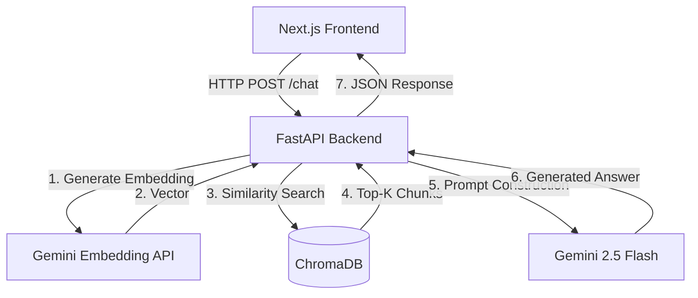
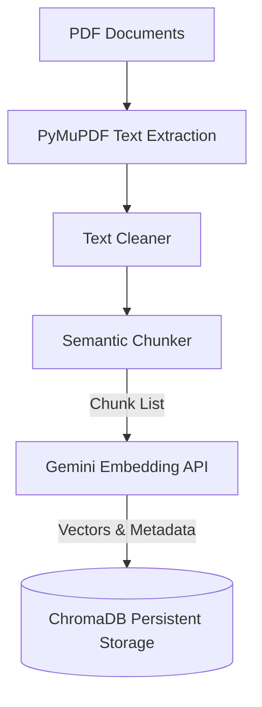
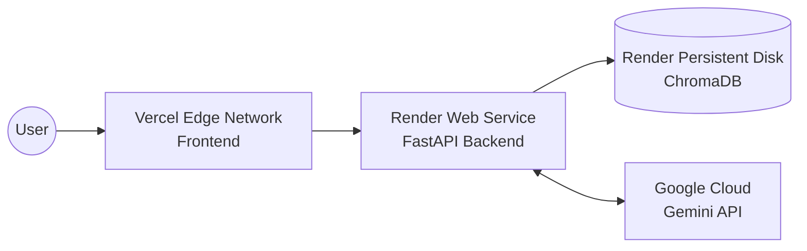

# System Architecture

This document outlines the architectural design of Policy Pilot, detailing the interactions between the frontend, backend, vector database, and the AI models.

## Overall Architecture

Policy Pilot utilizes a decoupled client-server architecture to ensure clear separation of concerns. The Next.js frontend handles the user interface and interactions, while the FastAPI backend manages data processing, database connections, and AI model orchestration.

## Frontend

The frontend is a lightweight, responsive Next.js application using Tailwind CSS for styling. It provides:
- A chat interface for user queries.
- Rendering of markdown responses and source citations.
- Connection health monitoring.

## Backend

The backend is built with FastAPI, prioritizing speed and type safety through Pydantic. It is structured modularly:
- **API Layer**: Exposes REST endpoints (`/chat`, `/health`).
- **Service Layer**: Contains business logic for document ingestion and retrieval.
- **Core Layer**: Manages configuration and environment variables.

## Ingestion Pipeline

The ingestion pipeline transforms raw PDFs into searchable vectors. This process runs automatically on backend startup if the vector database is missing.

### Text Chunking
Documents are chunked using word boundaries to avoid splitting mid-sentence. An overlap of approximately 200 characters is maintained to ensure contextual continuity between consecutive chunks.

## Retrieval Pipeline

The retrieval pipeline strictly follows the RAG methodology:

1. **Query Embedding**: The user's question is embedded using the Gemini Embedding API.
2. **Vector Search**: The embedding is used to query ChromaDB for the Top-4 most semantically similar document chunks.
3. **Prompt Assembly**: The retrieved chunks are injected into a strictly engineered prompt that instructs the LLM to only answer based on the provided context.
4. **Generation**: Gemini 2.5 Flash synthesizes the final response.

## Vector Database

**ChromaDB** is used as the persistent vector store. It runs locally on the backend server, storing vectors, original chunk texts, and metadata (filename, page number) directly in the `chroma_db/` directory.

## Deployment Architecture

The application is deployed across two serverless/PaaS providers to optimize for frontend delivery and backend processing.

