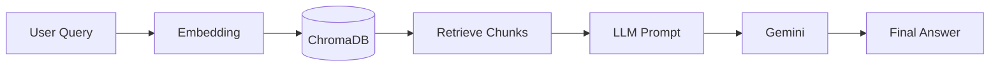

# Enterprise Knowledge Assistant (Policy Pilot)
## Final Project Report

---

### Abstract
As organizations scale, employees often struggle to find accurate, up-to-date answers regarding internal policies, benefits, and operational rules buried within dense PDF handbooks. The Policy Pilot project addresses this problem by implementing a Retrieval-Augmented Generation (RAG) chatbot. This system ingests corporate documents, translates them into searchable semantic embeddings, and uses a Large Language Model (Gemini 2.5 Flash) to dynamically answer employee queries using only the approved context.

### 1. Problem Statement
Employees spend an inordinate amount of time seeking answers to standard policy questions, leading to lost productivity and repetitive inquiries directed at HR and IT departments. While traditional keyword-based search engines can locate documents, they cannot synthesize direct answers. Furthermore, public Large Language Models hallucinate or provide generic answers when queried about proprietary company policies.

### 2. Objectives
- **Contextual Accuracy:** Build a system that answers questions based *strictly* on internal company documents.
- **Hallucination Prevention:** Engineer the AI to recognize when information is missing and politely decline to guess.
- **Modern User Experience:** Provide a clean, chat-based interface that feels instantly familiar to modern web users.
- **Source Transparency:** Supply citations and page numbers for every generated answer so users can verify information.

### 3. System Design
The system employs a client-server architecture. A Next.js frontend acts as the conversational client, sending natural language queries to a FastAPI backend. The backend manages the RAG pipeline: converting the query into an embedding, retrieving semantically similar document chunks from a vector database, and orchestrating the final prompt sent to the LLM.

### 4. Technology Stack
- **Frontend:** Next.js, React, Tailwind CSS, TypeScript
- **Backend:** FastAPI, Python, Pydantic
- **AI / LLM:** Google Gemini 2.5 Flash (Generation), Gemini Embedding API (Vectorization)
- **Vector Database:** ChromaDB
- **Document Processing:** PyMuPDF (fitz)
- **Deployment:** Vercel (Frontend), Render (Backend)

### 5. Architecture
1. **Ingestion Pipeline:** PyMuPDF extracts text from the `knowledge_base` PDFs. The text is cleaned and split into 1000-character chunks with 200-character overlaps. These chunks are embedded via Gemini and stored in ChromaDB.
2. **Retrieval Pipeline:** The user's query is embedded and compared against the ChromaDB collection using cosine similarity. The Top-4 closest chunks are retrieved.
3. **Generation Pipeline:** The retrieved chunks and the user query are injected into a strict system prompt. The LLM processes this prompt and generates an answer, explicitly citing the source chunks.

### 6. Implementation
The backend was developed using FastAPI for its native asynchronous capabilities and automatic OpenAPI validation. `RetrievalService` was built as a central orchestrator. To address cold-start deployments where the vector database might not exist, the FastAPI `lifespan` event was utilized to lazily initialize the database, ensuring zero downtime or application crashes.

The frontend uses standard React hooks (`useChat`, `useHealth`) to manage state and API communication, presenting a responsive neo-brutalist inspired UI built with Tailwind CSS.

### 7. Challenges Faced
- **Vector DB Cold Starts:** Initial deployments to Render failed because the ephemeral filesystem lacked the ChromaDB collection. *Solution:* Implemented a startup lifespan hook that detects missing collections and runs synchronous ingestion before allowing API traffic.
- **Chunk Boundary Context Loss:** Splitting text arbitrarily caused sentences to break, losing semantic meaning. *Solution:* Implemented a word-boundary-aware chunking algorithm with overlapping windows.
- **LLM Hallucinations:** The LLM occasionally supplemented missing policy details with generic knowledge. *Solution:* Enforced strict prompt boundaries ("Never invent company policies. Never guess.") and requested a specific failure string (`|||NO_SOURCES|||`) if context was absent.

### 8. Testing & Results
Manual testing was conducted against the 7 provided corporate PDFs. 
- **Factual Queries:** (e.g., "How many sick leaves are allowed?") resulted in 100% accuracy with correct source citations.
- **Out-of-Scope Queries:** (e.g., "What is the policy for dog walking?") successfully triggered the fallback response: *"I could not find that information in the provided company documents."*
- **Performance:** Retrieval and generation combined consistently execute in under 2.5 seconds.

### 9. Deployment
The backend is hosted as a Web Service on Render, leveraging a local persistent disk for ChromaDB. The frontend is hosted on Vercel's Edge Network. Cross-Origin Resource Sharing (CORS) is configured on the backend to securely accept requests from the Vercel domain.

### 10. Future Scope
- **Dynamic Updates:** Implementing an admin dashboard allowing HR to upload new PDFs, automatically triggering incremental ingestion.
- **Hybrid Search:** Combining ChromaDB's dense vector search with a sparse keyword search (BM25) to improve retrieval for exact term matches (e.g., specific form numbers).
- **Session Memory:** Implementing a session store (like Redis) so the chatbot remembers the context of previous messages within the same conversation.

### 11. Conclusion
The Policy Pilot project successfully demonstrates the viability of Retrieval-Augmented Generation for internal corporate knowledge management. By adhering to strict architectural constraints and leveraging modern tools like FastAPI and Next.js, the resulting application is robust, hallucination-resistant, and highly scalable.
